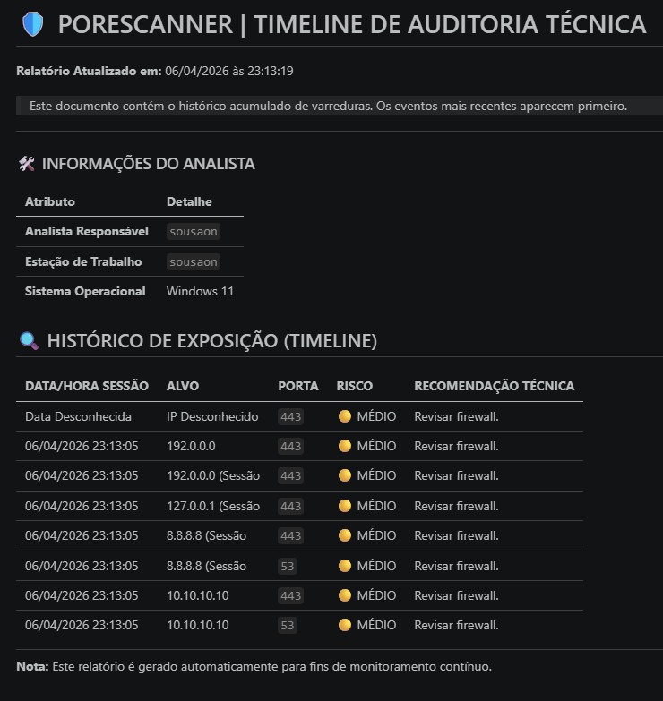

# 🛡️ PoreScanner v2.5 - Security Audit Suite

O **PoreScanner** evoluiu de um simples script para uma suíte modular de reconhecimento e auditoria de rede em Python. Projetada para analistas de SOC e Pentests, a ferramenta foca na identificação de superfícies de ataque e na geração automática de documentação técnica para remediação.

 

## 🚀 O que há de novo na v2.5?

Diferente de scanners convencionais, o PoreScanner foca no **pós-scan**: a comunicação entre o analista de segurança e o time de desenvolvimento/infraestrutura.
## 📊 Visualização do Relatório Técnico
Abaixo, um exemplo de como o `reporter.py` processa os dados e entrega uma interface limpa para o time de remediação:


### ✨ Diferenciais e Funcionalidades:
* **Arquitetura Modular:** Separação lógica entre o motor de varredura (`scanner.py`) e o processador de relatórios (`reporter.py`), seguindo boas práticas de engenharia de software.
* **Timeline de Auditoria (Histórico Reverso):** O sistema preserva todos os logs anteriores e organiza o relatório final apresentando os eventos mais recentes no topo, facilitando a triagem imediata.
* **Relatórios Técnicos Detalhados:** Gera automaticamente um arquivo `.md` profissional com matriz de risco (🔴 Alto, ⚫ Crítico, 🟡 Médio) e recomendações de hardening baseadas em padrões de mercado.
* **Rastreabilidade Forense:** Captura metadados da estação de trabalho (Hostname, SO, Usuário logado) para garantir a integridade da origem dos testes.

## 🛠️ Tecnologias e Ferramentas

* **Linguagem:** Python 3.x
* **Módulos:** `socket` (Rede), `platform/getpass` (Auditoria de Sistema), `datetime` (Timestamping).
* **Saída:** Relatórios formatados em **Markdown** para integração direta com GitHub/GitLab.

## 📋 Como Executar

1.  **Clone o repositório:**
    ```bash
    git clone [https://github.com/sousaon/PoreScanner.git](https://github.com/sousaon/PoreScanner.git)
    cd PoreScanner
    ```

2.  **Execute o motor principal:**
    ```bash
    python3 scanner.py
    ```

3.  **Fluxo de Trabalho:** * Digite o IP/Host para análise.
    * Ao finalizar os scans, escolha `y` para gerar o **Relatório Técnico**.
    * O arquivo `RELATORIO_TECNICO_DETALHADO.md` será gerado/atualizado na pasta raiz.
## 📊 Exemplo de Relatório de Auditoria

O relatório gerado transforma dados brutos em uma tabela de remediação pronta para o time de infraestrutura:

| DATA/HORA SESSÃO | ALVO | PORTA | RISCO | RECOMENDAÇÃO TÉCNICA |
| :--- | :--- | :--- | :--- | :--- |
| 06/04/2026 23:15:00 | `192.168.1.1` | `23` | ⚫ **CRÍTICO** | Telnet detectado. Desativar serviço imediatamente e substituir por SSH. |
| 06/04/2026 23:10:45 | `scanme.nmap.org` | `80` | 🟡 MÉDIO | HTTP exposto. Implementar redirecionamento para HTTPS (Porta 443). |

---
*Projeto desenvolvido para fins educacionais e de auditoria profissional de cibersegurança.*