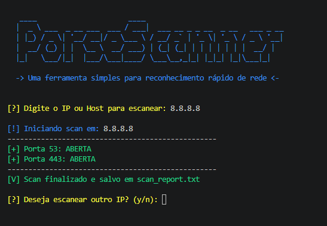

# 🛡️ PoreScanner - Fast Network Recon Tool

Uma ferramenta leve e eficiente em Python para identificação rápida de superfícies de ataque em ativos de rede, focada em simplicidade, automação e clareza de dados.

 

## 🚀 O que este projeto faz?

O **PoreScanner** é um script de automação de reconhecimento (footprinting) que verifica o estado das portas TCP mais comuns em um host alvo. Ele foi projetado para ser uma ferramenta de "primeira resposta", permitindo que um Analista de Segurança obtenha uma visão rápida dos serviços expostos de forma organizada e profissional.

### ✨ Diferenciais e Funcionalidades:
* **Loop de Execução:** Permite realizar múltiplos scans em sequência sem reiniciar a ferramenta.
* **Interface Limpa (UX):** Sistema de limpeza de tela automática e saída colorida para facilitar a leitura no terminal.
* **Persistência de Dados:** Gera um log automático (`scan_report.txt`) no modo *Append*, preservando o histórico de todos os scans realizados para auditoria.
* **Tratamento de Exceções:** Robusto contra erros de conexão, Hostnames inválidos e interrupções bruscas (Ctrl+C).

## 🛠️ Tecnologias e Ferramentas

* **Linguagem:** Python 3
* **Módulos Nativos:** `socket` (Redes), `os` (Interface), `datetime` (Timestamping).
* **Ambiente recomendado:** VS Code / Kali Linux.

## 💻 Como Executar

1.  **Clone o repositório:**
    ```bash
    git clone [https://github.com/sousaon/PoreScanner.git](https://github.com/sousaon/PoreScanner.git)
    cd PoreScanner
    ```

2.  **Execute o script:**
    ```bash
    python3 scanner.py
    ```

3.  **Uso:** Digite o IP ou Hostname desejado e, ao final, escolha `y` para um novo alvo ou `n` para encerrar e gerar o relatório.

## 📊 Exemplo de Saída no Log (`scan_report.txt`)

O arquivo de log armazena o histórico detalhado, ideal para compor relatórios de Pentest:

```text
--- Relatório de Scan: 2026-04-06 22:15:30 ---
Alvo: 192.168.1.1
- Porta 80 ABERTA
- Porta 443 ABERTA

--- Relatório de Scan: 2026-04-06 22:18:45 ---
Alvo: scanme.nmap.org
- Porta 22 ABERTA
- Porta 80 ABERTA